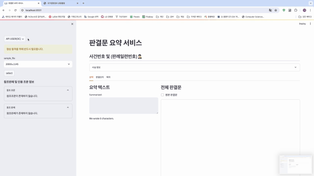
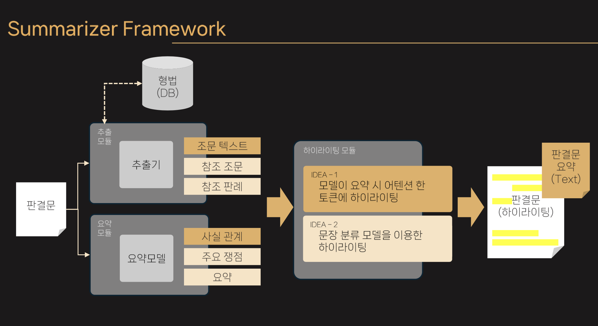

# precedent-summarize
## Project Overview
본 시스템은 일반 사용자 및 법률인이 판결문을 검색하고, 해당 판결문의 원문, 요약, 중요 정보 및 부가 정보를 조회할 수 있도록 지원하는 판결문 정보 검색 시스템입니다.

This system allows both the general public and legal professionals to search and view Korean court rulings, including the original texts, summaries, key facts, and supplementary legal information.

 

## Framework

  

### Functional Requirements(Korean)
| Seq ID | 기능 코드 | 기능명 | 설명 |
|--------|-----------|--------|------|
| 1 | SRCH10 | 판결문 검색 | 사용자가 판례문을 키워드로 검색 |
| 2 | SRCH11 | 판례일련번호 검색 | 사용자가 판례일련번호로 판결문 검색 |
| 3 | SRCH12 | 사건번호 검색 | 사용자가 사건번호로 판결문 검색 |
| 4 | VIEW10 | 판결문 정보 조회 | 판결문의 메타정보 확인 |
| 5 | VIEW11 | 판결문 본문 조회 | 판결문 전체 본문 열람 |
| 6 | VIEW12 | 판결문 요약 조회 | 판결문 요약 내용 확인 |
| 7 | VIEW13 | 부가정보 조회 | 인용 법조문, 판례번호 등 부가 정보 확인 |
| 8 | HIGH10 | 하이라이팅 기능 | 중요 정보에 대한 본문 하이라이팅 |
| 9 | HIGH11 | 요약 출처 기능 | 요약 정보의 출처를 본문에 시각적으로 표시 |
| 10 | HIGH12 | 판결요지 유사도 표시 | 본문 내 원 판결요지와 유사한 문장 강조 |

### Functional Requirements(English)
| Seq ID | Code | Feature | Description |
|--------|------|---------|-------------|
| 1 | SRCH10 | Case Search | Search court rulings by keyword |
| 2 | SRCH11 | Case Serial No. Search | Search by ruling serial number |
| 3 | SRCH12 | Case Number Search | Search by case number |
| 4 | VIEW10 | Ruling Info View | View ruling metadata |
| 5 | VIEW11 | Full Text View | View the full text of the ruling |
| 6 | VIEW12 | Summary View | View the summarized contents |
| 7 | VIEW13 | Supplementary Info View | View referenced laws, rulings, etc. |
| 8 | HIGH10 | Highlighting | Highlight key info in the ruling text |
| 9 | HIGH11 | Summary Source Trace | Visually mark sources in the summary |
| 10 | HIGH12 | Similarity Highlight | Highlight text similar to the official summary |

 

## 이벤트 흐름
### 1. 메인 흐름 (Main Flow)
1. 사용자가 판결문 검색 페이지에 접속
2. 사건번호 또는 판례일련번호로 검색어 입력
3. 시스템이 해당 키워드를 포함한 판결문 리스트 제공
4. 사용자가 원하는 판결문 선택
5. 시스템이 본문, 요약, 중요 정보 및 부가 정보를 함께 제공
---
1. User accesses the search interface  
2. Enters a keyword, case number, or serial number  
3. System returns a list of matching rulings  
4. User selects a ruling  
5. System provides full text, summary, key and supplementary info
 

### 2. 예외 흐름 (Exceptional Flow)
- **(가)** 검색 결과 없음 → “해당 판결문이 존재하지 않습니다.” 메시지 출력  
- **(나)** 검색어 미입력 → 전체 판결문 중 5건을 임의로 추천 표시  
- **(다)** 중요 사실 정보 없음 → “중요 사실 정보가 없습니다.” 메시지 출력
---
- **(a)** If no result found → “No matching ruling found.”  
- **(b)** If no input given → Random 5 rulings from database shown  
- **(c)** If no key facts found → “No key facts available.”
 

## 유스케이스 및 액터(Use Case & Actor)
- **관련 유스케이스(Related Use Case):** 없음  
- **관련 액터(Actor):** 사용자 (User)

